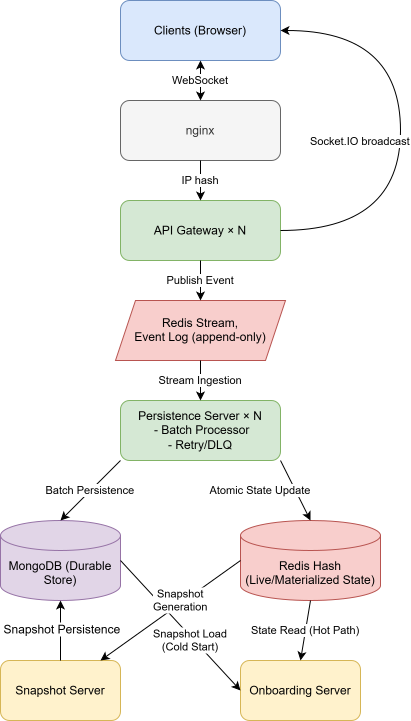

## What is Collaborative Canvas?

Collaborative Canvas is a real-time multiplayer drawing application. Multiple users can draw on a shared canvas simultaneously and see each other's strokes appear live, without refresh, without delay.

Building this is harder than it sounds. The system has to handle several things at once:

- Deliver drawing actions to every connected user fast enough that it feels instant
- Never lose a stroke, even if a server crashes mid-write
- Load a room's full canvas history quickly when a new user joins, even if thousands of strokes have been drawn
- Scale horizontally so more servers can be added without changing how the system works

These four requirements pull in different directions. Speed wants things to stay in memory. Durability wants things written to disk. Fast joins want history to be pre-processed. Scaling wants servers to coordinate without talking to each other. The architecture is the answer to those tensions.

---

## The Big Picture

The system is split into four types of services. Each one has a single job and communicates with the others through a shared message queue - they never call each other directly. This means any service can be restarted, scaled up, or replaced without affecting the others.

## What Each Service Does

### API Gateway

The front door of the system. Every browser connects here over a WebSocket. When a user draws a stroke, the gateway receives it and immediately puts it on the message queue. It also broadcasts the action to other users in the same room so they see it in real time.

The gateway is kept deliberately thin. It does not write to the database, does not process messages, and does not make decisions about what to do with data. Its only job is to move things in and out as fast as possible. Authentication, rate limiting, and input validation are planned for this layer - the structure already reserves space for them without requiring any redesign.

### Persistence Servers

These servers sit on the message queue and write drawing actions to the database. Multiple persistence servers run at the same time and share the work - if one is busy, another picks up the next message. They also maintain a live copy of the canvas state in fast memory (Redis) so other parts of the system can read it instantly without hitting the database.

Persistence servers are built to handle failures gracefully. If a database write fails, the server retries with increasing delays. If a message is permanently unwritable, it is moved to a quarantine queue rather than silently dropped, so nothing is ever lost without a record.

### Snapshot Servers

As a room accumulates history, loading it from scratch becomes expensive. Snapshot servers solve this by periodically compacting groups of drawing actions into single summary documents. When a new user joins a room that has been active for hours, they load one snapshot plus only the recent messages since that snapshot, rather than the full history. This keeps join times fast regardless of how long a room has been active.

### Onboarding Servers

When a user opens a room, the onboarding server is responsible for sending them everything they need to see the current canvas state. For active rooms it reads directly from the fast in-memory state maintained by the persistence servers, making this nearly instant. For rooms that have gone quiet it falls back to the database, using snapshots to keep the query efficient.

---

## How Services Stay Coordinated

Services never call each other directly. Instead they share two things: the message queue (Redis Stream) and a live registry of which servers are currently running (also in Redis).

Each server continuously announces itself to this registry. If a server crashes, it stops announcing and is automatically removed after a short timeout. The remaining servers notice and redistribute work among themselves. No manual intervention is required and no central coordinator needs to be told - the system heals itself.

This registry also solves a subtle problem: if two persistence servers both try to write to the same room at the same time, they could conflict. To prevent this, each server uses the registry to calculate which rooms it is responsible for. All servers independently arrive at the same answer using the same formula, so there is never a conflict and no coordination message needs to be sent.

---

## What Happens on the Client

The browser is not a passive receiver. Three pieces of client-side logic make the experience feel smooth:

**Stroke interpolation.** Users send raw pointer positions as they draw. The client uses a mathematical interpolation technique (Catmull-Rom splines) to draw smooth curves between those points in real time. This means the server stores compact raw inputs rather than dense point clouds, reducing both bandwidth and storage without any visible quality loss.

**Gap detection.** Every message from the server carries a sequence number. If the client notices a gap in the sequence - a message that should have arrived but did not - it stops rendering that stroke and waits. After a short threshold it requests the missing message. This prevents half-drawn strokes from appearing on screen when network packets arrive out of order.

**Eraser.** The eraser does not send individual point deletions to the server. Instead the client handles all the geometry locally - using a spatial grid to efficiently check which strokes the eraser overlaps - and sends a single "delete this stroke" message when the operation is complete. The server sees a simple delete; the client handles the complexity.

---

## Key Technology Choices

| Decision            | Choice               | Why                                                                                                 |
| ------------------- | -------------------- | --------------------------------------------------------------------------------------------------- |
| Message queue       | Redis Streams        | Provides consumer groups, ordering, and acknowledgement without adding a separate broker like Kafka |
| Database            | MongoDB              | Flexible document model suits variable canvas message shapes                                        |
| Real-time transport | Socket.IO            | Handles WebSocket with automatic fallback and room-based broadcasting                               |
| Coordination        | Redis ZSet heartbeat | Servers self-organise without a central coordinator like ZooKeeper                                  |
| Load balancing      | nginx                | IP hashing for gateway (sticky WebSocket connections), round-robin for onboarding (stateless)       |

---

## What is Not Built Yet

The system is functional but two areas are still in progress:

**Authentication.** The API Gateway layer is explicitly designed to host auth, rate limiting, and validation. No structural changes are needed - these are the next things to be added.

**Gap recovery.** The client detects missing messages and knows how to ask for them. The server-side handler that fulfils those requests is not yet implemented.

**Metadata consistency.** Room statistics are written to two places at once (Redis and MongoDB). In a rare failure scenario these can briefly disagree. A planned improvement (the outbox pattern) will make one a consequence of the other, eliminating the inconsistency window entirely.
