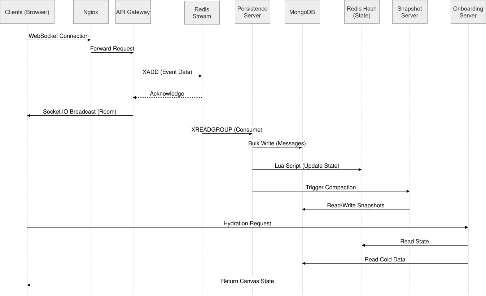
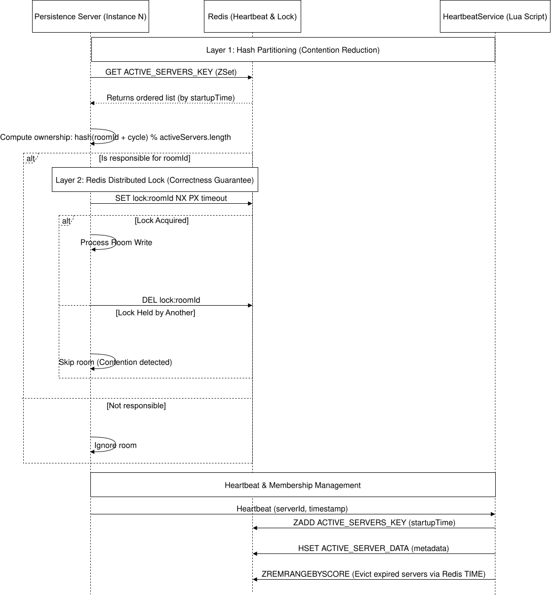
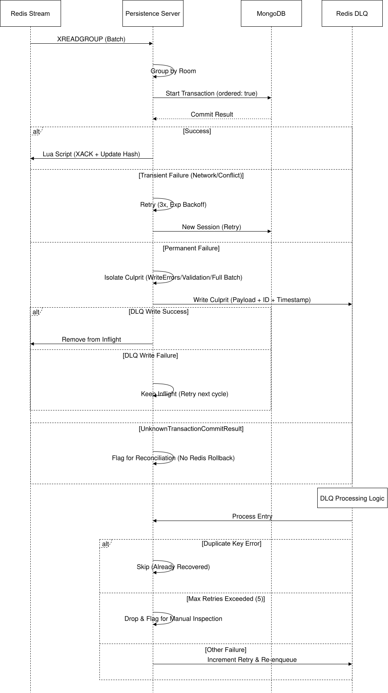

# Collaborative Canvas - Technical Architecture

> **Architecture:** Event-Driven Microservices  
> **Stack:** TypeScript · Node.js · Redis · MongoDB · Socket.IO · nginx · Lua

---

## Table of Contents

1. [Architecture Overview](#1-architecture-overview)
2. [Message Lifecycle State Machine](#2-message-lifecycle-state-machine)
3. [API Gateway Servers](#3-api-gateway-servers)
4. [Persistence Servers](#4-persistence-servers)
5. [Snapshot Servers](#5-snapshot-servers)
6. [Onboarding Servers](#6-onboarding-servers)
7. [HeartbeatService - Distributed Service Registry](#7-heartbeatservice--distributed-service-registry)
8. [Dead-Letter Queue](#8-dead-letter-queue-dlq)
9. [Known Limitations and Planned Improvements](#9-known-limitations-and-planned-improvements)
10. [Design Patterns Reference](#10-design-patterns-reference)

---

## 1. Architecture Overview

Collaborative Canvas is built as an event-driven service architecture. Services communicate exclusively through a Redis Stream, no service calls another directly. This keeps each service independently deployable and removes synchronous coupling from the critical user-facing path.

| Component           | Technology            |
| ------------------- | --------------------- |
| Message Broker      | Redis Streams         |
| In-Memory State     | Redis (Hash, ZSet)    |
| Persistent Store    | MongoDB               |
| Real-Time Transport | Socket.IO (WebSocket) |
| Atomic Scripting    | Lua                   |
| Load Balancing      | nginx (round-robin)   |
| Language            | TypeScript / Node.js  |



### Service types

| Service                | Role                                                                               |
| ---------------------- | ---------------------------------------------------------------------------------- |
| **API Gateway**        | WebSocket termination, stream ingestion, future auth/validation layer              |
| **Persistence Server** | Competing consumers, transactional batch write to MongoDB, Redis state maintenance |
| **Snapshot Server**    | Async compaction of persisted message intervals, metadata reconciliation           |
| **Onboarding Server**  | Stateless client hydration - Redis-hot or MongoDB-cold path                        |

### Shared infrastructure

- **Redis** - message broker (Streams), in-memory state (Hash, ZSet), service registry (ZSet)
- **MongoDB** - durable canvas message store and room metadata
- **nginx** - Round-robin in front of all tiers; sticky sessions not required due to Socket.IO Redis adapter

---

## 2. Message Lifecycle State Machine


Every canvas message moves through a defined set of states tracked in a Redis Hash. The hash is the shared mutable state of the system - the source of truth for what has happened to each message and what still needs to happen.

Two services write to this shared hash: the Persistence Server and the Snapshot Server. This is a deliberate architectural choice - both services need to advance message lifecycle state and update room metadata counters. Strict single-writer ownership was considered but would require an additional coordination service that adds complexity without benefit at this scale. The tradeoff is accepted with the understanding that all writes to shared fields use atomic Lua scripts to prevent race conditions.

---

## 3. API Gateway Servers

Each API Gateway server maintains persistent Socket.IO connections with browser clients. nginx sits in front of the gateway tier with **IP hashing** enabled, ensuring each client's WebSocket connection is consistently routed to the same server instance across reconnects.

### Responsibilities

- Accept Socket.IO connections from clients
- Receive canvas actions and write them to the Redis Stream as fast as possible
- Broadcast actions to other connected clients in the same room
- **Future:** authentication, authorization, rate limiting, and input validation - all centralized at this layer

### Why round-robin is safe at the load balancer

Socket.IO connections are stateful by default, but the Socket.IO Redis adapter makes them cluster-aware. Events emitted on any gateway instance are propagated to all others via Redis pub/sub, so a client can land on any server without losing messages or requiring session transfer. IP hashing is therefore unnecessary.

### Why Redis Streams over Kafka

Kafka provides stronger durability guarantees, log compaction, and higher throughput than Redis Streams. However it requires a dedicated broker cluster and either Zookeeper or KRaft coordination - substantial operational overhead for a 2 developer project. Redis Streams provides all required semantics (consumer groups, ordered delivery, message acknowledgement, persistent storage) without adding infrastructure complexity. Redis is already in the stack as the caching and state layer. The choice is deliberate and scale-appropriate.

---

## 4. Persistence Servers

Persistence servers form a **consumer group** on the Redis Stream. Redis distributes messages across all running instances, ensuring each message is processed exactly once. This is the competing consumers pattern - horizontal scaling of the write path with no additional coordination required.

### Room ownership via consistent hashing



Although Redis handles deduplication across consumers, it does not guarantee all messages for a given room land on the same server. To prevent concurrent batch writes to the same room from multiple servers, each persistence server uses the HeartbeatService to determine whether it is responsible for a given room before processing it.

The assignment algorithm:

```
cycle_number      = floor(Date.now() / cycleDurationMs)
responsibleIndex  = stableHash(`${roomId}-${cycle_number}`) % activeServers.length
isMyRoom          = (responsibleIndex === myServerIndex)
```

Using a time-based cycle number means room ownership rotates periodically, providing natural rebalancing. Using a stable hash means all servers independently arrive at the same assignment without communicating - no coordination round trip required.

### Batch write pipeline

Messages are batched by room and written to MongoDB in a single bulk operation. The persistence cycle is triggered by whichever threshold is crossed first: a message count threshold or a time-based timeout. This dual-trigger approach prevents both large memory accumulation and excessive write latency.

### Transactional write

Each bulk write executes inside a MongoDB session with `ordered: true`, meaning the batch halts at the first failure and the exact failing document index is always known. The bulk write and the room metadata counter update are committed atomically in a single transaction.

### Retry logic

On transient failures the pipeline retries up to three times with exponential backoff (200ms → 400ms → 800ms). A new session is created per attempt - a session that experienced a transient error is considered potentially dirty and never reused.

Transient errors are classified by:

- `MongoNetworkError` / `MongoNetworkTimeoutError` instance checks
- `TransientTransactionError` / `RetryableWriteError` error labels
- A known set of server codes (host unreachable, primary stepped down, shutdown in progress)

Everything else is treated as permanent.

### Culprit isolation

On permanent failure the pipeline does not discard the entire batch. It identifies the specific failing document and routes only that document to the DLQ, leaving the rest of the batch to be retried in the next consumer cycle.

Culprit identification follows this priority:

1. **`writeErrors` present** - `ordered: true` gives the exact failing index directly from MongoDB
2. **Validation error, no `writeErrors`** - pipeline inspects each document for missing required fields
3. **Neither** - failure is at the operation level; entire batch routes to DLQ

A document is only considered a confirmed culprit once its DLQ write succeeds. If the DLQ write itself fails, the document is left inflight so the next consumer cycle picks it up rather than silently dropping it.

### Commit ambiguity guard

If `commitTransaction` throws `UnknownTransactionCommitResult`, the pipeline does not attempt to roll back Redis. The commit may have succeeded server-side and rolling back Redis would risk undoing a write that actually landed. These cases are flagged for reconciliation. A Redis rollback is only attempted when the commit is definitively known to have failed.

### Post-commit cleanup

After a successful commit a Lua script runs atomically in Redis to:

- Remove processed messages from the inflight and snapshotted queues
- Move them into the `persistedAwaitingSnapshot` queue
- Update room metadata counters with `HINCRBY` to avoid lost updates from concurrent writers
- Acknowledge the messages in the consumer group

Two distinct error types distinguish infrastructure failures from state mismatches after cleanup:

- `RedisCleanupEvalError` - the eval itself failed; the script may not have run at all
- `RedisCleanupEmptyResultError` - the script ran but found nothing; indicates a state mismatch

In both cases the pipeline logs and exits without retrying, the commit already landed and deduplication handles re-consumption on the next cycle.

### Dual-write limitation and planned resolution

Room metadata counters are maintained in both Redis and MongoDB and updated as part of every persistence cycle. The Redis copy is updated via Lua script for atomicity; the MongoDB copy is updated inside the same transaction as the bulk write. A known limitation exists: if Redis fails after the MongoDB commit succeeds, the Redis copy becomes stale. This will be resolved by implementing the **outbox pattern**, which will make Redis metadata updates a downstream consequence of the committed MongoDB write rather than a concurrent operation.

---

## 5. Snapshot Servers

Snapshot servers compact intervals of persisted canvas messages into single summary documents in MongoDB. This is an **async compaction pipeline** - conceptually similar to log compaction in event-sourced systems. Its purpose is to bound the cost of onboarding: without snapshots, a busy room would require loading and replaying potentially thousands of individual message documents to reconstruct canvas state.

### Operation

Snapshot servers read directly from the Redis Hash, they do not consume from the Redis Stream. They operate on already-processed state rather than raw events. When a compaction cycle runs for a room, the server reads the current message set, writes a compacted snapshot document to MongoDB, then advances the message lifecycle state in the Redis Hash and updates room metadata counters.

### Shared state writes

Snapshot servers update the same Redis Hash fields and room metadata counters that persistence servers write to (see [Section 2](#2-message-lifecycle-state-machine)). All writes use atomic Lua scripts, and the risk of conflicting concurrent writes is mitigated by the consistent hashing room assignment - the same server that owns a room for persistence also owns it for snapshotting within a cycle.

---

## 6. Onboarding Servers

Onboarding servers handle initial state hydration for clients connecting to a room. They sit behind nginx with **round-robin** load balancing - initial loads are stateless, so any instance can serve any request.

### Hot path - Redis Hash

For active rooms, the full message state is available in the Redis Hash maintained by the persistence servers. The onboarding server reads directly from this hash, providing sub-millisecond response times for rooms with active users.

### Cold path - MongoDB with snapshot acceleration

For rooms that have gone quiet and been evicted from Redis, the onboarding server falls back to MongoDB. It first loads the most recent snapshot document (if one exists), then loads only the messages that arrived after that snapshot. Without snapshots this would require loading the full message history. With snapshots the query is bounded to recent-only messages, keeping onboarding cost approximately constant rather than growing linearly with room history.

---

## 7. HeartbeatService - Distributed Service Registry

The HeartbeatService is a Redis-backed distributed presence and service registry. It gives every server instance a consistent, ordered view of all currently active peers, enabling decentralised room ownership assignment without a central coordinator.

### Data model

```
ACTIVE_SERVERS_KEY  (ZSet)
  score  → startupTime
  member → serverId

ACTIVE_SERVER_DATA  (Hash)
  key   → serverId
  value → JSON blob (port, startupTime, status, ...)
```

### Heartbeat cycle

Each server sends a heartbeat on a fixed interval via a Lua script that runs atomically and performs three operations:

1. `ZADD` the server into the ZSet using `startupTime` as the score (not current time - see below)
2. `HSET` the server's metadata into the hash
3. Clean up servers whose last heartbeat exceeds the timeout threshold using Redis `TIME` to avoid clock drift across nodes

### Why `startupTime` as the ZSet score

Using `startupTime` as the score rather than the current timestamp ensures a server's position in the ordered list is stable for its entire lifetime. If the current timestamp were used, every heartbeat would change every server's score, causing the ZSet order to fluctuate and potentially invalidating room ownership assignments mid-cycle. `startupTime` produces a stable, monotonically increasing rank across the cluster.

### Failure detection and self-healing

If a server crashes, loses network, or stops sending heartbeats, it is automatically removed from the ZSet and Hash after the timeout window. The remaining servers' next call to `getActiveServers()` returns the updated list, and the consistent hashing algorithm redistributes ownership across the surviving nodes. No manual intervention is required and no central coordinator needs to be notified.

### Singleton guarantee

The service is implemented as a singleton (`HeartbeatService.instance`) to ensure exactly one heartbeat loop runs per process, regardless of how many places in the codebase access it.

---

## 8. Dead-Letter Queue (DLQ)



The DLQ is a separate Redis Stream. Each entry carries the original payload, original Redis message ID, and a timestamp. Documents in the DLQ are processed independently - one failure does not block others.

### DLQ processing logic

| Condition                        | Action                                                     |
| -------------------------------- | ---------------------------------------------------------- |
| Exceeds `MAX_DLQ_RETRIES` (5)    | Permanently dropped, flagged for manual inspection         |
| Duplicate key error from MongoDB | Document already exists - treated as recovered and skipped |
| Any other failure                | Retry count incremented, document re-enqueued              |

The confirmed-culprit guarantee means a document is only removed from the main inflight queue once the DLQ write succeeds. If the DLQ write itself fails, the document remains inflight and will be picked up again on the next consumer cycle rather than being silently dropped.

---

## 9. Known Limitations and Planned Improvements

### Dual-write gap

Redis metadata may become stale if Redis fails after a successful MongoDB commit. **Planned fix:** outbox pattern - make Redis updates a downstream consequence of the committed MongoDB write rather than a concurrent operation.

### Shared write ownership

Both persistence and snapshot servers write to the same Redis Hash fields and metadata counters. Mitigated by atomic Lua scripts and consistent hashing ensuring the same server owns a room across both operations within a cycle. A strict single-writer model would be cleaner but adds coordination overhead not justified at this scale.

### No auth layer yet

Authentication, authorisation, rate limiting, and input validation are planned for the API Gateway layer. The architecture explicitly reserves this layer for those concerns - no structural changes will be required when they are implemented.

### Redis as single point of failure

The entire system's hot path runs through a single Redis instance. Redis Sentinel or Redis Cluster would add high availability. Not implemented given the project scope.

---

## 10. Design Patterns Reference

| Pattern                               | Where Applied                                                                |
| ------------------------------------- | ---------------------------------------------------------------------------- |
| **Competing Consumers**               | Persistence servers share a Redis Stream consumer group                      |
| **Message Lifecycle / State Machine** | Redis Hash tracks each message through defined states                        |
| **Async Compaction Pipeline**         | Snapshot servers fold message history into checkpoints                       |
| **Dead-Letter Queue**                 | Unrecoverable messages quarantined in a separate Redis Stream                |
| **Culprit Isolation**                 | Failed documents isolated from healthy batch members                         |
| **Gossip-style Service Registry**     | HeartbeatService ZSet provides decentralised peer discovery                  |
| **Consistent Hashing (time-sliced)**  | Room ownership assigned deterministically without coordination               |
| **Dual-trigger Batch (debounce)**     | Persistence cycle fires on count threshold or timeout, whichever comes first |
| **Commit Ambiguity Guard**            | Protects against double-apply on `UnknownTransactionCommitResult`            |
| **Outbox Pattern**                    | Planned - will decouple Redis metadata updates from MongoDB commits          |
